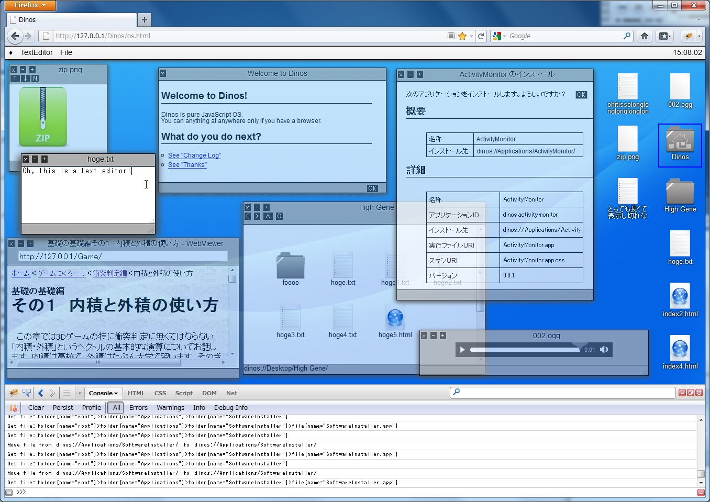

# Dinos

Demo: http://nodaguti.usamimi.info/test/dinos/os.html

JavaScript にて開発したデスクトップ環境(もどき)です。
2012年ごろまでのブラウザでは動作しましたが、
その後メンテナンスを行っていないため、現在のブラウザでは動作しないかもしれません。

(追記: Firefox 38.0.5, Chrome 43, Safari 8.0.6 にて動作することを確認しました)

## Motivation

2011年3月頃、当時実装され始めていた HTML5 API を利用することで
OS もどきのようなものが作れるのではないかと考え、受験の息抜きに開発をはじめました。

## 実装済みの機能

- ウィンドウ制御
- XML ベースのファイルシステム (disk.xml)
- 一通りのアプリケーション (application フォルダ以下にあります)
    - ファイルマネージャ (Finder)
    - 画像閲覧ソフト (ImageViewer)
    - テキストエディタ (TextEditor)
    - 音楽プレイヤ (AudioPlayer)
    - Web ブラウザ (WebViewer)
    - アクティビティモニタ (ActivityMonitor)
    - メニューバー (Menubar)
    - メニューバー上の時計 (Clock)
    - 設定マネージャ (PrefManager)
    - アプリケーションインストーラ (SoftwareInstaller)

## 動作環境
2011年10月現在:

- IE 9
- Firefox 3.5以降　（Firefox 3.5は起動するが表示が一部おかしい個所があります）
- Opera 11.5以降　（Opera 11.5は一部表示がおかしい個所があります）
- Google Chrome最新版　（少なくともバージョン11で起動することを確認しています）
- Safari 5以降

起動時にディスク(disk.xml)を読み込むため、コード全体をサーバ上にアップロードする必要があります。

## データの受け渡しについて

### PC→Dinos
ファイルをブラウザ上にドラッグアンドドロップすることでDinos上にファイルをインポートすることができます。

### Dinos→PC
メニューバー「◆」→「Save Computer...」よりDinosのデータをPC上にダウンロードすることができます。
将来的にはファイルごとにダウンロードできるようになる予定です。
